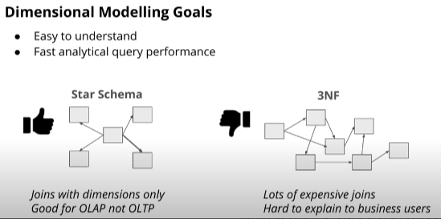
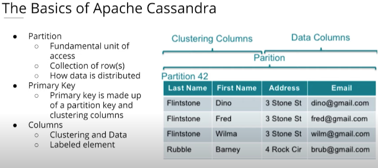

# Data Modeling

### Data modeling is an abstraction that organizes elements of data and how they relate to each other.

- Its organization is extremely important and makes everyone's life easier.
- Having the data model well thought out before hand is crucial for how data can be consumed later.
- Goal is to have queries simple and straightforward.
- Start early and build in flexibilty to allow for changes later.

### Schemas, Fact and Dimensional Modeling

- Fact tables
  - Record business events: orders, reviews, id's.
  - Record events in quantifiable metrics
  - Numeric & Additive format
- Dimension tables
  - Record the context for the event: who, what, where & why
  - Dimension table columns contain the attributes, text and numeric.

### Relational Databases (SQL) vs NoSQL Databases

#### Relational

- Postgres, Oracle, MySQL, MSSQL ... Many more
- A collection of tables with columns and rows.
- Ability to do JOINs, aggregations and analytics.
- ACID Transactions intended to guarantee validity.

#### NoSQL

- Cassandra, MongoDB, Redis, DynamoDB ... Many more
- Flexible schemas usually in Key:Value pairs.
- Great for large amounts of data in many formats and unstructured.
- High throughputs, fast reads.
- Horizontal scalability, just add more nodes or machines.

### Modeling with Postgres

#### Using python in the terminal and in Jyupter Notebooks with the psycopg2 package to connect to a local Postgres Database.

- [Connecting to a Postgres DB with Python (.ipynb file)](./PostgresTableDataModeling/1.0-ConnectingPythonToPostgres.ipynb)
- [Creating Tables in Postgres (.ipynb file)](./PostgresTableDataModeling/1.1-CreatingTableInPostgres.ipynb)
- [Creating Normalized Tables (.ipynb file)](./PostgresTableDataModeling/2.0-CreatingNormalizedTables.ipynb)
- [Creating Denormalized Tables (.ipynb file)](./PostgresTableDataModeling/2.1-CreatingDenormalizedTables.ipynb)
- [Creating a Star Schema with Fact and Dimension Tables (.ipynb file)](./PostgresTableDataModeling/2.2-CreatingFactAndDimensionTablesStarSchema.ipynb)
- **Project:** Create an ETL process that extracts JSON data, transform it into a star schema writing it to a Postgres Database then write queries to read the data.
  - [Detailed Project information & folder](./PostgresTableDataModeling/ProjectFolder)
  - Python scripts to run in the folder:
    - Run first to create the database and tables.
      $ python create_tables.py
    - Run second, it will process the JSON files and insert into the DB.
      $ python elt.py
    - [Query the data with the test.ipynb file](./PostgresTableDataModeling/ProjectFolder/test.ipynb)

### Modeling with Cassandra

#### I will be running cassandra in a docker container and starting either through docker desktop or in VS Code Docker interface. Using python and the cassandra package to connect and interface with the cassandra database.

- [Creating a Table in Cassandra (.ipynb file)](./CassandraDataModeling/1.0-CreatingTableWithCassandra.ipynb)
- [Two Queries in Two Tables (.ipynb file)](./CassandraDataModeling/2.0-2Queries2Tables.ipynb)
- [Adding Primary Keys (.ipynb file)](./CassandraDataModeling/2.1-PrimaryKey.ipynb)
- [Using Clustering Columns (.ipynb file)](./CassandraDataModeling/2.2-ClusteringColumn.ipynb)
- [Using the Where Clause to query data (.ipynb file)](./CassandraDataModeling/2.3-UsingWhereClause.ipynb)
- **Project:** Create an ETL pipeline that takes data from CSV files and inserts that into the tables created. Run queries on the data thats inserted into the Cassandra DB.
  - The CSV data is stored in folder event_data
  - [ETL Pipeline using Python and Cassandra (.ipynb file)](./CassandraDataModeling/ProjectFolder/ETLPipelineProcessingCSVFiles.ipynb)
